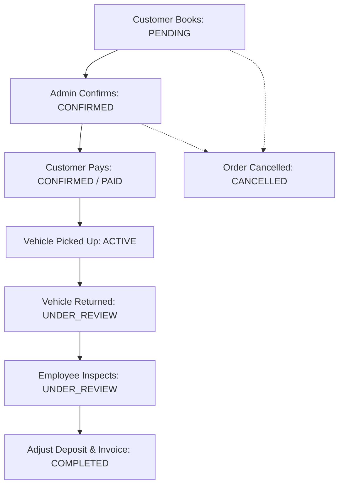

# Vehicle Rental ERP Restructuring Specification

This document defines the architectural and operational blueprint to transition the Car Rental Management System from a basic CRUD application into a professional, cohesive Enterprise Resource Planning (ERP) platform.

---

## 1. Core Goal
Build a professional **Vehicle Rental ERP** rather than a collection of isolated CRUD modules. Related processes are grouped into a single unified business workflow, keeping the user interface clean and the database highly normalized.

---

## 2. Navigation & Sidebar Restructuring

We will simplify the sidebar by grouping operational activities under their parent domain entities rather than exposing every database table as a separate menu item.

| Current Sidebar (CRUD Layout) | New Sidebar (ERP Layout) |
| :--- | :--- |
| ❌ Dashboard |  Dashboard |
| ❌ Categories |  Categories |
| ❌ Vehicles |  Vehicles |
| ❌ Rental Periods |  Customers *(New)* |
| ❌ Rental Orders |  Rental Orders *(Primary Hub)* |
| ❌ Quotations |  Payments |
| ❌ Payments |  Security Deposits |
| ❌ Security Deposits |  Reports |
| ❌ Pickups |  Settings |
| ❌ Returns |  Profile |
| ❌ Penalties | *(Operational steps merged into Orders)* |
| ❌ Reports | |
| ❌ Settings | |
| ❌ Profile | |

---

## 3. Database Schema Consolidation

To maintain a clean and normalized database, we will consolidate helper/operational tables directly into the `RentalOrder` and `Vehicle` models.

### Tables to Keep
*   **Users** (Auth and credentials)
*   **UserAddresses** (Customer delivery/billing locations)
*   **Categories** (Vehicle categorization)
*   **Vehicles** (Core physical assets)
*   **VehicleImages** (Image asset attachments)
*   **RentalOrders** (The core transaction hub)
*   **Payments** (Financial payment logs)
*   **SecurityDeposits** (Deposit collection & refund logs)
*   *Optional:* **VehicleMaintenance** (Asset health tracking)

### Tables to Remove (Merge into `RentalOrder` or `Vehicle`)
*   ❌ **Pickup** (Merged into `RentalOrder` fields)
*   ❌ **Return** (Merged into `RentalOrder` fields)
*   ❌ **Penalty** (Merged into `RentalOrder` fields)
*   ❌ **RentalPeriod** (Merged into `RentalOrder` configuration)
*   ❌ **RentalItem** (Simplified or merged)
*   ❌ **PriceList** (Simplified or defined directly under Vehicles)
*   ❌ **Quotation** (Merged as a `DRAFT` status of `RentalOrder`)
*   ❌ **Notification** (Handled dynamically)
*   ❌ **OrganizationSetting** (Handled via config or settings)

---

## 4. Unified Rental Order Workflow

Operational stages (Pickup, Return, Inspections, Penalties) represent **workflow states** rather than independent database entities. `RentalOrder` is the central model holding the entire customer journey.



### Simple Master Statuses
*   `PENDING`: Booking requested by customer, awaiting admin review.
*   `CONFIRMED`: Approved by admin, vehicle reserved, waiting for payment/pickup.
*   `ACTIVE`: Customer has paid and collected the vehicle; rental is ongoing.
*   `UNDER_REVIEW`: Vehicle returned, waiting for condition inspection and deposit settlement.
*   `COMPLETED`: Closed successfully after return inspection, deposit adjustment, and final invoice.
*   `CANCELLED`: Booking cancelled before pickup; vehicle released.

### Sub-Process Fields on the `RentalOrder`

Instead of changing the master status for every sub-step, each sub-process manages its own status flags:

*   **Pickup Status:** `PENDING` | `COMPLETED`
*   **Payment Status:** `PENDING` | `PAID` | `FAILED` | `REFUNDED`
*   **Deposit Status:** `HELD` | `PARTIALLY_REFUNDED` | `REFUNDED`
*   **Return Condition:** `GOOD` | `MINOR_DAMAGE` | `MAJOR_DAMAGE`
*   **Vehicle Availability Status:** `AVAILABLE` | `RESERVED` | `RENTED` | `MAINTENANCE`

---

## 5. End-to-End Order Walkthrough (Example Order #1001)

| Stage | Action | RentalOrder Status | Vehicle Status | Payment/Deposit Details |
| :--- | :--- | :--- | :--- | :--- |
| **1. Booking** | Customer books vehicle online. | `PENDING` | `AVAILABLE` | Payment `PENDING` |
| **2. Review** | Admin confirms booking. | `CONFIRMED` | `RESERVED` | Payment `PENDING` |
| **3. Checkout** | Customer completes payment. | `CONFIRMED` | `RESERVED` | Payment `PAID` |
| **4. Handover**| Customer picks up vehicle. | `ACTIVE` | `RENTED` | Pickup Status ➡️ `COMPLETED` |
| **5. Return** | Customer returns vehicle. | `UNDER_REVIEW` | `RENTED` | Actual Return Date filled |
| **6. Inspect** | Employee inspects vehicle (e.g., minor scratch). | `UNDER_REVIEW` | `RENTED` | Condition ➡️ `MINOR_DAMAGE`, Penalty ➡️ `₹500` |
| **7. Settle** | Penalty deducted; remaining deposit returned. | `UNDER_REVIEW` | `RENTED` | Deposit Status ➡️ `REFUNDED` (Refund: ₹1500) |
| **8. Close** | Invoice generated; order completed. | `COMPLETED` | `AVAILABLE` | Order successfully closed |

---

## 6. UI/UX Consolidation: Rental Order Details Page

Instead of navigating between separate modules (Pickup Page, Return Page, Penalty Page), everything is managed inside a single, comprehensive **Rental Order Details** page:

```
+-------------------------------------------------------------+
| RENTAL ORDER #1001                                          |
+-------------------------------------------------------------+
| [Customer Info]            | [Vehicle Details]              |
| Name: John Doe             | Toyota Fortuner (GJ01AB1234)   |
| Email: john@example.com    | Color: White | Seats: 7        |
+----------------------------+--------------------------------+
| [Rental Schedule]          | [Payment Summary]              |
| Period: 3 Days             | Base Cost: ₹9,000              |
| Pickup: Oct 12, 10:00 AM   | Deposit Held: ₹10,000          |
| Return: Oct 15, 10:00 AM   | Final Total: ₹10,120           |
+----------------------------+--------------------------------+
| [Pickup Details]           | [Return Details]               |
| Odo: 12,000 km | Fuel: 100% | Odo: 12,450 km | Fuel: 95%     |
| Sign-off: Checked          | Condition: GOOD                |
+----------------------------+--------------------------------+
| [Order Timeline]                                            |
|  09:00 AM - Order Created                                   |
|  09:15 AM - Order Confirmed by Admin                        |
|  10:00 AM - Vehicle Picked Up (Odo: 12,000 km)              |
|  (Pending) - Return Inspection                              |
+-------------------------------------------------------------+
```

---

## 7. Development Roadmap

### Phase 1: Database Restructuring
1.  Update the `schema.prisma` file to match consolidated entities.
2.  Remove obsolete tables (`Pickup`, `Return`, `Penalty`, `RentalPeriod`, `RentalItem`, `PriceList`, `Quotation`, `Notification`, `OrganizationSetting`).
3.  Create a fresh database migration.
4.  Write seed scripts to verify database relationships.

### Phase 2: Foundation Modules (API & Client)
1.  **Categories**
2.  **Vehicles & Vehicle Images**
3.  **Users & User Addresses**
4.  **Authentication & Role Guard**

### Phase 3: Core Business Engine
1.  **Rental Orders** (State transitions, unified CRUD)
2.  **Payments & Stripe Integration**
3.  **Security Deposits** (Hold and refund logic)
4.  **Invoices** (Auto-generation on completion)

### Phase 4: Analytics & Dashboard
1.  Dashboard KPIs (Active Rentals, Revenue, Vehicle Status counters)
2.  Monthly Operations & Financial Reports
3.  Analytical charts (Revenue trends, category demand)

---

## 8. ERP Coding Architecture Standard

Every module in the codebase must follow a strict layered pattern:

$$\text{Routes} \longrightarrow \text{Validation (Express-Validator/Zod)} \longrightarrow \text{Controller} \longrightarrow \text{Service} \longrightarrow \text{Prisma} \longrightarrow \text{PostgreSQL}$$

### Architectural Constraints
*   **Controllers** must be extremely thin, handling **only** HTTP request parsing and response delivery. They must contain no business rules or DB calls.
*   **Services** must house **all** business logic, state checking, calculations, and data transactions.
*   **Prisma Client** is the exclusive wrapper for all database read and write queries.